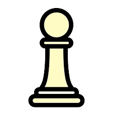
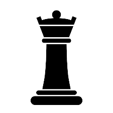
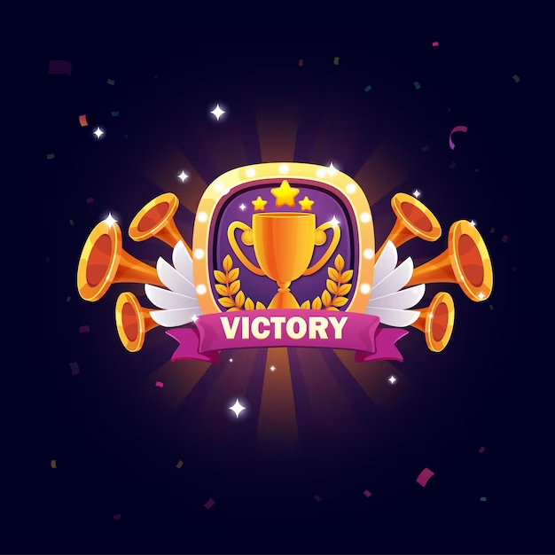
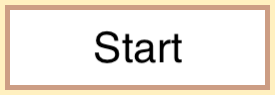

## Folder containing the images of the game 

#### Table of contents

* [Chess Pieces](#chess-pieces)
* [Buttons](#buttons-and-images)

## Chess Pieces

[Chess Pieces Folder](./PNG_Chess_Game_Pieces/)
#### White Pawn

#### Black Queen

## Buttons and Images

[Buttons Folder](./Buttons/) 
#### Victory Image

#### New Game Button

#### Start Button

