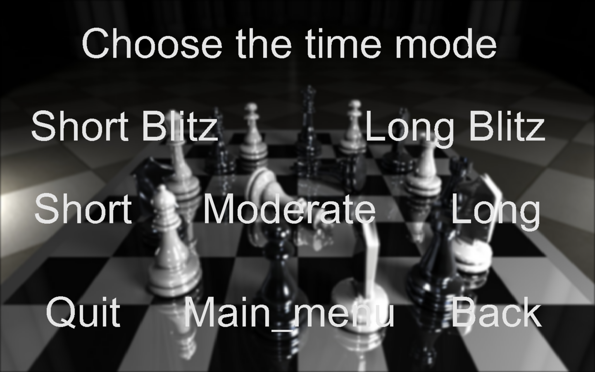

# Chess Engine in C 
> Here is the continuation of the chess game programming project. It's an upgrade compared to the previous chess engine where lany things related to the game has been changed.
The graphic interface has been modified a bit. To make it faster and have a better AI, I changed a lot of the way to calculate things. The AI also uses transpositions tables, iterative deepening and an opening book, with a much faster move generation. I also added some keyboard shortcuts to easily proceed the tests.

#### Tables of contents
* [Folders](#folders)  
* [About SDL](#about-SDL)  
* [Concerning the tests](#concerning-the-tests)
* [To run this project](#to-run-this-project)
* [To play the game](#to-play-the-game)
* [Structure of each file](#structure-of-each-file)

## Folders 
* [Chess Engine](./Chess_Engine/) : 
    * [AI_Data](./Chess_Engine/AI_Data/) : datas used for the AI search later
    * [AI_Functions](./Chess_Engine/AI_Functions/) : make the AI search and play
    * [Game_Treatment](./Chess_Engine/Game_Treatment/) : functions that are linked to the game state and treat what happens
    * [Main](./Chess_Engine/Main/) : functions where everything is linked together
    * [Useful](./Chess_Engine/Useful/) : functions not chess related to fast things up
* [Evolution](./Evolution/)
* [Game Exemples](./Game_Exemples/)
* [Images](./Images/)
* [Sounds](./Sounds/)

## About SDL
Here's the website to find out more about this library (which allows us to make graphics and play on them, for example): 
* [SDL website](https://www.libsdl.org) / [SDL library](https://wiki.libsdl.org/SDL2/FrontPage) for everything, with installation setup or link to the code of the SDL 
* the wiki_lib is very useful to be able to easily search function, things that can be done and how to implement, to gain time by searching : 
1. The type of category of functions that act on differents parts ([Search by Category](https://wiki.libsdl.org/SDL2/APIByCategory))
2. The name of the function , but it requires to know well the library and what it can do ([Search by Name](https://wiki.libsdl.org/SDL2/CategoryAPI))
* I've succeeded this time to download the sdl_ttf and sdl_image extensions, thus the graphics were way easier to implement


## To run this project
In the root of the project folder : 
* do the command `make` to create all the .o and .x file
* do the command `make realclean` to clean all the .x and .o file everywhere in the project
* launch the game with `./Chess_Engine/Chess_Game.x`


## To play the game 

#### How to use the keyboard keys and the clicks on screen
* After launching it, you have to **click on the different texts or rectangle buttons** to perfom the task you want 
* They **are shortcuts** not to lose time waiting for the menus to work _(these are in the **Chess_Game.c** file at the **SDL_KEYDOWN** part during the main loop of the game)_
    * `esc` : quit the game and download its current state
    * `a` : setup a game AIvsAI with the preselected AI levels
    * `d` : download its current state
    * `g`: generates all the possibles moves and show the current log content
    * `h`: setup a game for two humans player
    * `l`: setup a game HUMANvsAI with the preselected AI settings
    * `o`: load the previous game saved to continue playing it
    * `p`: pause the game _(used to stop the AI to search moves when we want to undo something)_
    * `r`: restart a game
    * `s`: start a game
    * `t`: show the content of the transposition tables
    * `u`: undo the last move made
    * `z`: get the current zobrist key of the current state of the chessboard
* You need to click on the **start button** to be able **to launch the timer** and then play the game and your moves
* To move the piece, you need to **click and slide** the piece to their destination 
* There is a result at the end with a **victory menu** where you **still can undo the ending move** to change the game outcome
* You can see the **last 10 complete moves of the log** of the game _(Move like Nbd2 aren't represented here, only Nd2 will be shown, every thing else is the formal chess game log)_
* When playing against an AI, it will show the **search depth reached**, the **move made** _(evaluated as best)_ and the **evaluation** of the move _(the score or the fact that it was taken from the opening book)_

#### Gameplay choice menu


#### Color choice menu


#### AI difficulty choice menu


#### Time choice menu


#### Start of the game


#### Opening Book used by AI


#### In game screenshot


#### Victory menu choice


#### Undoing the victory menu


## Concerning the tests
* everything has been test after its implementation to make sure it does what it was supposed to do


## Structure of each file

#### .h file
* will have the explications concerning the description of the function and what I will used for 
* will also give the parameters the function is taking 
* code structure : 

```c
#ifndef __FILENAME_H__
#define __FILENAME_H__


#include <…>
…
…
#include <…>


/////////////////////////////////////////////////////////////////////////////////////
// Filename Summary : (+ Resume of this file)
/**
 * 
 … 
 Resume of the different functions we can find on this file
 …
 *
**/
/////////////////////////////////////////////////////////////////////////////////////


/////////////////////////////////////////////////////////////////////////////////////
// Description of what the function is doing 
/**
 * @param parameter1 - description of parameter_1
 * @param parameter1 - description of parameter_2
 * …
 * …
 * @param parameter1 - description of parameter_n
**/ 
/////////////////////////////////////////////////////////////////////////////////////
header of the function 


…
make other function
…


/////////////////////////////////////////////////////////////////////////////////////
// Description of what the function is doing 
/**
 * @param parameter1 - description of parameter_1
 * @param parameter1 - description of parameter_2
 * …
 * …
 * @param parameter1 - description of parameter_n
**/ 
/////////////////////////////////////////////////////////////////////////////////////
header of the function 


#endif /* __FILENAME_H__ */
```

#### .c file 
* will not include the header, but it will be commented to know what are the things done inside the different functions
* code structure : (spacing and commenting the code to make it easy to copy and to understand)

```c
#include "filename.h"


function_1


function_2


…
…


function_n
```
